# Diagramme des cas d'utilisation

```mermaid
flowchart LR
    Admin(("Administrateur"))
    Formateur(("Formateur"))
    Etudiant(("Étudiant"))

    subgraph Auth [Authentification]
      UC1[Se connecter]
      UC2[Se déconnecter]
    end

    subgraph GestionEtudiants [Gestion des étudiants]
      UC3[Lister / rechercher / filtrer les étudiants]
      UC4[Ajouter un étudiant]
      UC5[Modifier un étudiant]
      UC6[Supprimer un étudiant]
    end

    subgraph GestionFormateurs [Gestion des formateurs]
      UC7[Lister / rechercher les formateurs]
      UC8[Ajouter un formateur]
      UC9[Modifier un formateur]
      UC10[Supprimer un formateur]
    end

    subgraph GestionFormations [Gestion des formations]
      UC11[Créer une formation]
      UC12[Modifier une formation]
      UC13[Supprimer une formation]
      UC14[Rechercher / filtrer / trier les formations]
      UC15[Consulter les inscrits d'une formation]
    end

    subgraph GestionInscriptions [Gestion des inscriptions]
      UC16[S'inscrire à une formation]
      UC17[Annuler une inscription]
      UC18[Consulter ses inscriptions]
      UC19[Attribuer / modifier une note]
      UC20[Consulter les moyennes]
    end

    subgraph Statistiques [Statistiques]
      UC21[Consulter le tableau de bord]
      UC22[Consulter les statistiques globales]
    end

    Admin --> UC1
    Admin --> UC2
    Admin --> UC3
    Admin --> UC4
    Admin --> UC5
    Admin --> UC6
    Admin --> UC7
    Admin --> UC8
    Admin --> UC9
    Admin --> UC10
    Admin --> UC11
    Admin --> UC12
    Admin --> UC13
    Admin --> UC14
    Admin --> UC15
    Admin --> UC17
    Admin --> UC21
    Admin --> UC22

    Formateur --> UC1
    Formateur --> UC2
    Formateur --> UC15
    Formateur --> UC19
    Formateur --> UC20
    Formateur --> UC21

    Etudiant --> UC1
    Etudiant --> UC2
    Etudiant --> UC14
    Etudiant --> UC16
    Etudiant --> UC17
    Etudiant --> UC18
    Etudiant --> UC20
    Etudiant --> UC21
```

## Description synthétique des cas d'utilisation

| Cas d'utilisation | Acteur(s) | Description courte |
|---|---|---|
| Se connecter / se déconnecter | Tous | Authentification par email + mot de passe, session Flask-Login |
| Gestion des étudiants (CRUD, recherche, filtre par niveau) | Admin | CRUD complet sur la collection `etudiants` |
| Gestion des formateurs (CRUD, recherche) | Admin | CRUD complet sur la collection `formateurs` |
| Gestion des formations (CRUD, recherche, filtre, tri) | Admin | CRUD complet sur la collection `formations` |
| Consulter les inscrits d'une formation | Admin, Formateur | Liste des étudiants inscrits, avec leurs notes |
| S'inscrire / annuler une inscription | Étudiant (Admin peut annuler) | Création/mise à jour d'un document `inscriptions` |
| Consulter ses inscriptions / notes | Étudiant | Lecture filtrée par `etudiant_id = current_user.ref_id` |
| Attribuer / modifier une note | Formateur | Mise à jour du champ `note`, limitée aux formations dont il est responsable |
| Consulter le tableau de bord / statistiques | Tous (contenu différent par rôle) | Agrégations MongoDB (`$group`, `$lookup`, etc.) |
